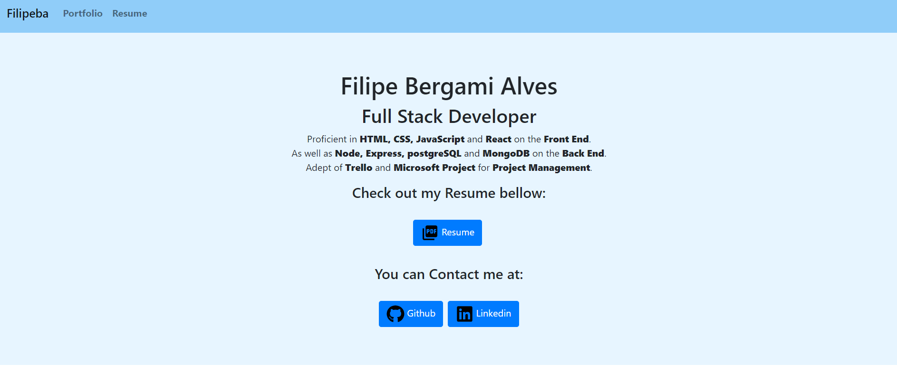
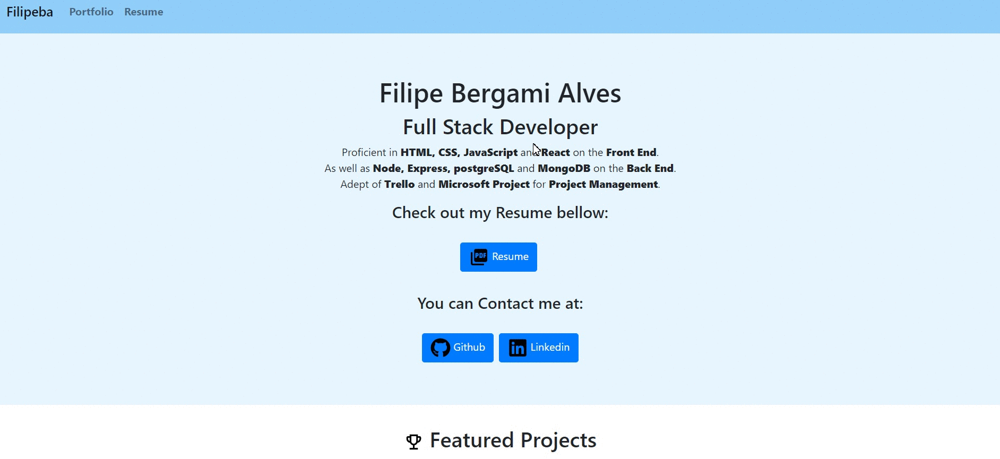

<a href="https://filipeba.net"></a>

# Portfolio Website

> Showcase Projects, Contact information and Resume.

> Mobile First Design, Stable, Fast and Responsive.

> Portfolio, Website, Project, JavaScript, HTML, CSS, React, Front End, Back End, Full Stack, Node, MongoDB, PostgreSQL, Server, Database, Web Developer, Developer, Engineer, Software, Computer Science, Code, Programming.

<a href="http://g.recordit.co/rHHrvjdQyO.gif"></a>

## Table of Contents

- [Installation](#installation)
- [Features](#features)
- [Usage](#usage)
- [Test](#test)
- [Technologies](#technologies)
- [Contact](#contact)
- [License](#license)


---

## Installation

- Access the website at [https://filipeba.net](https://filipeba.net)

## Features

- Mobile First Design
- Stable
- Fast 
- Responsive

## Usage

- Home
- Portfolio
- Resume
- Resume PDF

## Test

### Browsers

- Chrome (v81.0): ✔
- Firefox (v76.0): ✔
- IE (v11.778): ✘
- Edge (v81.0): ✔
- Safari (v5.1): ✘

### Devices

- Desktop: ✔
- Laptop: ✔
- iphone SE: ✔
- Samsung Note 9: ✔
- iPad Pro: ✔

---

## Technologies

- Dependencies:

```
React-Bootstrap // `https://react-bootstrap.netlify.app/`
tachyons // `https://www.npmjs.com/package/tachyons`
```
- Package Manager
```
NPM
```
- Front End:
```
JavaScript Framework: React
CSS Framework: React-Bootstrap
```
- Deployment
```
Github Pages (Front End)
```

---

## Contact

Reach out to me at:

- Portfolio at <a href="" target="_blank">`https://filipeba.net`</a>
- Email at <a href="mailto: filipeba.ict@gmail.com" target="_blank">`Filipeba.ict@gmail.com`</a>
- Linkedin at <a href="https://linkedin.com/in/filipebaict" target="_blank">`https://linkedin.com/in/filipebaict`</a> 

---

## License

- Copyright 2020 © <a href="https://filipeba.net" target="_blank">Filipe Bergami Alves</a>.